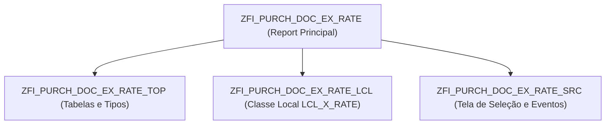

# Análise Técnica: Programa ZFI_PURCH_DOC_EX_RATE e Correção do Campo KUFIX (Taxa de Câmbio Fixa)

**Empresa / Sistema**: Salsa Jeans (IVN) | SAP PRD (`S4P`) Mandante 100  
**Módulos**: MM-PUR, FI-TR, FI-GL  
**Data da Análise**: Setembro / 2026  
**Status**: Especificação Técnica e Guia de Correção  

---

## 1. Objetivo deste Documento

Este documento detalha a arquitetura do programa customizado **`ZFI_PURCH_DOC_EX_RATE`**, o funcionamento da classe local **`LCL_X_RATE`**, as BAPIs envolvidas e o diagnóstico de causa raiz do campo **`EKKO-KUFIX`** (Fixação da taxa de câmbio no pedido de compras).

Adicionalmente, formaliza o ponto exato de alteração de código para eliminar a dependência da tabela descontinuada/vazia **`ZFI_TCURR_T`** e migrar para a tabela standard **`TCURR`** via função homologada SAP.

---

## 2. Arquitetura do Programa `ZFI_PURCH_DOC_EX_RATE`

O report principal **`ZFI_PURCH_DOC_EX_RATE`** é composto por 3 includes:



### 2.1. `ZFI_PURCH_DOC_EX_RATE_TOP`
- **Tabelas declaradas**: `EKKO`, `SSCRFIELDS`, `ZFI_DOC_EX_LOG_T`.
- **Tipos principais**:
  - `TY_AUTO`: Estrutura de exibição para atribuição automática (`BUKRS`, `WAERS`, `EBELN`, `EINDT`, `PDATE`, `NETWR`, `LIFNR`, `CHECK`).
  - `TY_MANUAL`: Estrutura de exibição para atribuição manual vinculada a contrato de Tesouraria existente (`BUKRS`, `WAERS`, `RFHA`, `EBELN`, `CHECK`).
  - `TY_FTR_CRE`: Parâmetros para abertura da operação financeira FX (`BUKRS`, `SGSART`, `SFHAART`, `KONTRH`, `AMOUNT`, `SAMOUNT`).

### 2.2. `ZFI_PURCH_DOC_EX_RATE_SRC`
Interface do usuário com 3 modos de execução (Radiobuttons):
- `P_RAD1` (**Atribuição Automática**): Seleciona pedidos abertos em moeda estrangeira, calcula a data de pagamento prevista e cria automaticamente uma operação de FX em Tesouraria (`FTR_CREATE`).
- `P_RAD2` (**Atribuição Manual**): Vincula pedidos selecionados a um contrato de Tesouraria (`RFHA`) previamente existente.
- `P_RAD3` (**Visualização de Log**): Consulta a tabela de histórico e auditoria `ZFI_DOC_EX_LOG_T`.

### 2.3. `ZFI_PURCH_DOC_EX_RATE_LCL` (Classe `LCL_X_RATE`)
Contém toda a lógica de negócio do programa:

| Método | Finalidade |
| :--- | :--- |
| `CONSTRUCTOR` | Obtém parâmetros de negócio via `ZCLCA_FIXEDVALS=>GET_CONS_VAL` (módulo `FIN`, processo `'PO_EXCHANGE_RATE'`). |
| `AUTO_INST_ASSIGN` | Filtra pedidos em `EKKO`/`EKPO`/`EKET`, exclui pedidos já logados em `ZFI_DOC_EX_LOG_T`, calcula a data de pagamento (`PAY_DATE = ZZDAT02 - NDAYS + ZTAG1`) e renderiza o ALV. |
| `MANUAL_INST_ASSIGN` | Valida a operação `VTBFHA`, seleciona pedidos correspondentes e exibe no ALV. |
| `ON_USER_COMMAND` | No botão customizado `MYFUNC`: executa Batch Input `CALL TRANSACTION 'FTR_CREATE'` (modo automático) ou recupera `KKURS` de `VTBFHAZU` (modo manual), e itera sobre os pedidos chamando `CHANGE_EX_RATE` e `UPD_LOG`. |
| `CHANGE_EX_RATE` | Executa a alteração do cabeçalho do pedido chamando a **`BAPI_PO_CHANGE`**. |
| `UPD_LOG` | Obtém detalhes do contrato via **`BAPI_FTR_GETDETAIL`** e persiste na tabela **`ZFI_DOC_EX_LOG_T`**. |
| `SET_LOG_MESSAGE` | Grava histórico no log de aplicação SAP (`ZCLCA_BAL_LOG`, objeto `'ZFI'`). |

---

## 3. BAPIs e Transações Utilizadas

1. **`BAPI_PO_CHANGE`** (`ZFI_PURCH_DOC_EX_RATE_LCL`, linha 1296):
   - Atualiza o pedido com o valor da taxa negociada em Tesouraria:
     ```abap
     LS_POHEADER-COMP_CODE = IV_BUKRS.
     LS_POHEADER-EXCH_RATE = IV_KKURS * -1.
     LS_POHEADX-EXCH_RATE = 'X'.

     CALL FUNCTION 'BAPI_PO_CHANGE'
       EXPORTING
         PURCHASEORDER = IV_EBELN
         POHEADER      = LS_POHEADER
         POHEADERX     = LS_POHEADX
       TABLES
         RETURN        = LT_RET.
     ```
2. **`BAPI_TRANSACTION_COMMIT`** (linha 1332) / **`BAPI_TRANSACTION_ROLLBACK`** (linha 1369):
   - Controle transacional com commit síncrono (`WAIT = 'X'`).
3. **`BAPI_FTR_GETDETAIL`** (linha 1407):
   - Lê os atributos da transação de Tesouraria (`RFHA`) para enriquecimento do log.
4. **`CALL TRANSACTION 'FTR_CREATE'`** (linha 1077):
   - Execução via Batch Input (`MODE 'E' UPDATE 'S'`) para criação do negócio financeiro.

---

## 4. Diagnóstico e Causa Raiz do Campo `KUFIX`

### 4.1. O que é o campo `KUFIX` e onde ele impacta?
- **Tabela**: `EKKO-KUFIX` (Indicador: Fixação de taxa de câmbio).
- **Importância em FI**: No **BTE 1120** (`ZCL_FI_PROCESS_00001120`, linha 138), ao contabilizar faturas e documentos contábeis (ex: `MIRO`), o SAP faz:
  ```abap
  SELECT SINGLE KUFIX, WKURS FROM EKKO 
    INTO ( @DATA(LV_KUFIX), @DATA(LV_WKURS) ) 
   WHERE EBELN = @LS_BSEG-EBELN.

  IF LV_KUFIX = ABAP_TRUE.
    <FS_CURRENCYAMOUNT>-EXCH_RATE = 1 / ( LV_WKURS * -1 ).
  ```
  Se `KUFIX = 'X'`, a taxa do pedido é forçada na fatura. Se estiver desmarcado, a fatura adota a taxa corrente de mercado da data de lançamento, provocando divergências cambiais indesejadas.

### 4.2. Por que o `KUFIX` não estava sendo marcado?

A fixação da taxa no pedido ocorre por duas vias:

1. **Via Standard**: Na chamada da `BAPI_PO_CHANGE`, o campo correspondente ao `EKKO-KUFIX` na estrutura `BAPIMEPOHEADER` chama-se **`EX_RATE_FX`**. No report `ZFI_PURCH_DOC_EX_RATE`, o método `CHANGE_EX_RATE` passava apenas `EXCH_RATE`, omitindo `EX_RATE_FX`.
2. **Via BAdI Customizada de Pedidos (`ME_PROCESS_PO_CUST`)**:
   - Classe: **`ZCLMM_MEPO_CUST`**
   - Método: **`DEFINE_EXCHANGE_RATE`** (include `ZCLMM_MEPO_CUST===============CM00B`)
   - O código tentava buscar cotações na tabela customizada **`ZFI_TCURR_T`**:
     ```abap
     SELECT * FROM ZFI_TCURR_T INTO TABLE @DATA(LT_TCURR) ...
     ```
   - **Causa Raiz**: Como a tabela `ZFI_TCURR_T` foi descontinuada e está 100% vazia no ambiente PRD, `LT_TCURR` sempre retornava vazia.
   - Consequentemente, o bloco das linhas 180–186 nunca era executado:
     ```abap
     IF LT_TCURR IS NOT INITIAL.
       ...
       CS_HEADER-KUFIX = ABAP_TRUE. " <--- NUNCA ERA EXECUTADO!
       LO_HEADER->SET_DATA( CS_HEADER ).
     ENDIF.
     ```

---

## 5. Guia de Alteração de Código (Solução Definitiva)

### Alteração 1: Na BAdI de Pedidos `ZCLMM_MEPO_CUST` (Substituir `ZFI_TCURR_T` por Standard `TCURR`)

* **Classe**: `ZCLMM_MEPO_CUST`
* **Método**: `DEFINE_EXCHANGE_RATE`
* **Include**: `ZCLMM_MEPO_CUST===============CM00B`
* **Linhas a substituir**: Linhas **147 a 188**

> [!CAUTION]
> Na tabela standard `TCURR`, o campo de data `GDATU` é armazenado pelo SAP de forma invertida (`99999999 - DATA`). Não deve ser feito `SELECT` direto sem tratamento de escala e tipo de cotação. A melhor prática oficial é invocar a função standard **`READ_EXCHANGE_RATE`**.

#### Código Proposto:
```abap
        DATA: LV_UKURS_STD TYPE TCURR-UKURS,
              LV_FFACT     TYPE TCURR-FFACT,
              LV_TFACT     TYPE TCURR-TFACT.

        " Obter cotação na tabela standard TCURR para a data prevista (LV_BEGDA)
        CALL FUNCTION 'READ_EXCHANGE_RATE'
          EXPORTING
            DATE             = LV_BEGDA
            FOREIGN_CURRENCY = CS_HEADER-WAERS
            LOCAL_CURRENCY   = CS_HEADER-GRWCU
            TYPE_OF_RATE     = 'M'  " Ou ler de ZCA_CONSTANTS_T (ex: 'EURX' / 'M')
          IMPORTING
            EXCHANGE_RATE    = LV_UKURS_STD
            FOREIGN_FACTOR   = LV_FFACT
            LOCAL_FACTOR     = LV_TFACT
          EXCEPTIONS
            NO_RATE_FOUND    = 1
            NO_FACTORS_FOUND = 2
            NO_SPREAD_FOUND  = 3
            DERIVED_2_TIMES  = 4
            OVERFLOW         = 5
            ZERO_RATE        = 6
            OTHERS           = 7.

        IF SY-SUBRC = 0 AND LV_UKURS_STD IS NOT INITIAL.
          IF CS_HEADER-WKURS NE LV_UKURS_STD.
            CS_HEADER-WKURS = LV_UKURS_STD * -1.
            CS_HEADER-KUFIX = ABAP_TRUE.   " <--- Ativa a flag no cabeçalho do pedido
            LO_HEADER->SET_DATA( CS_HEADER ).
          ENDIF.
        ENDIF.
```

---

### Alteração 2: No Report `ZFI_PURCH_DOC_EX_RATE` (Garantir o `KUFIX` na chamada da BAPI)

* **Programa**: `ZFI_PURCH_DOC_EX_RATE`
* **Include**: `ZFI_PURCH_DOC_EX_RATE_LCL`
* **Método**: `CHANGE_EX_RATE`
* **Linhas**: **1279 a 1282**

#### Código Atual:
```abap
LS_POHEADER-COMP_CODE = IV_BUKRS.
LS_POHEADER-EXCH_RATE = IV_KKURS * -1.
LS_POHEADX-EXCH_RATE  = 'X'.
```

#### Código Ajustado:
```abap
LS_POHEADER-COMP_CODE  = IV_BUKRS.
LS_POHEADER-EXCH_RATE  = IV_KKURS * -1.
LS_POHEADX-EXCH_RATE   = 'X'.

" Garantir que a taxa atribuída via Tesouraria fique explicitamente fixada no EKKO
LS_POHEADER-EX_RATE_FX = 'X'.  " Campo mapeado para EKKO-KUFIX na BAPIMEPOHEADER
LS_POHEADX-EX_RATE_FX  = 'X'.  " Flag de atualização na BAPIMEPOHEADERX
```

---

## 6. Validação e Ferramentas Criadas

Para validação em lote de pedidos no ambiente SAP PRD, foi disponibilizado no repositório o utilitário:
- **`validar_pos_kufix.py`**: Ferramenta gráfica via RFC que permite carregar ficheiros Excel contendo números de POs e inspecionar em tempo real na tabela `EKKO` quantas estão com `KUFIX = ' '` (desmarcado) e `KUFIX = 'X'` (marcado).
