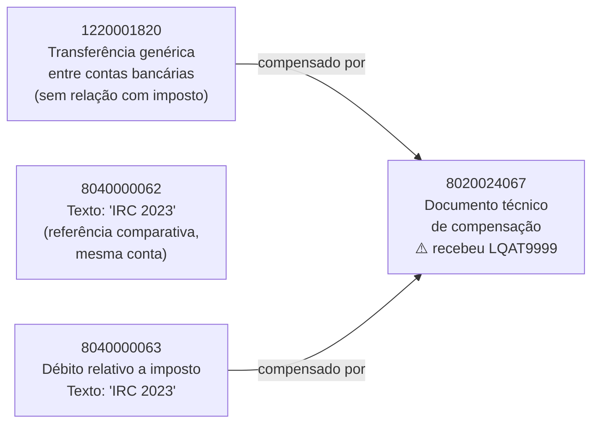

# Fluxo de Caixa / Item de Liquidez (New Cash Management) — Conhecimento e Investigação

**Empresa/Sistema**: SAP S/4HANA PRD (ashost `172.19.34.22`, client `100`) — caso de origem na empresa **2010 (Salsa Luxemburgo)**, exercício **2025**
**Escopo**: Investigação read-only (RFC_PING/RFC_READ_TABLE) de classificação incorreta de Item de Liquidez em documentos financeiros compensados
**Data de Consolidação**: 2026-09-21
**Status**: 🟡 Em investigação — causa raiz arquitetural identificada por evidência de tabelas; confirmação definitiva (debugger/trace ABAP) ainda pendente. Conversa para continuar.

---

## 1. Objetivo deste Documento

1. Registar o que já foi validado sobre o mecanismo de Item de Liquidez (Cash Management) neste sistema, para não repetir a investigação de tabelas do zero.
2. Documentar o caso de estudo do documento `8020024067` (empresa 2010, 2025), que recebeu o item de liquidez `LQAT9999` (técnico/eliminação) quando o esperado era `LQAO0141` (Rec. impostos s/ rendimento).
3. Servir de contexto para retomar esta conversa mais tarde.
4. Descrever as ferramentas read-only criadas no projeto para apoiar este tipo de investigação (`sap_rfc/cash_flow_validation_service.py` e o processo de cockpit `Processos/Validar Fluxo de Caixa`).

---

## 2. Regra de Segurança

Toda a investigação relacionada com este tema **é estritamente read-only**: apenas `RFC_PING` e `RFC_READ_TABLE`. Nunca eliminar, nunca compensar (transação FB1x/F-03 etc.), nunca reverter documentos. Isto aplica-se a qualquer script, processo de cockpit ou continuação desta investigação.

---

## 3. O que NÃO é o mecanismo (descartado)

- **`SKB1-FIPOS`** ("Grupo de Fluxo de Caixa" clássico) — confirmado **CHAR14, presente** em `BSEG`, `BSEG_ADD`, `SKB1`, `FAGL_SPLINFO`, mas **completamente vazio/não utilizado em todo o sistema PRD**. Não é a origem da classificação `LQAO0141`/`LQAT9999` observada.
- Verificado também em `BSEG_ADD` e `FAGL_SPLINFO` diretamente para o documento `8020024067` — sem dados relevantes de FIPOS.

---

## 4. O que É o mecanismo: S/4HANA New Cash Management (FQM)

A classificação de Item de Liquidez vem do **New Cash Management / Cash Operations (FQM)**, calculado **em runtime** via views HANA, e não gravado como campo estático legível diretamente por `RFC_READ_TABLE` na maioria dos casos.

### 4.1 Mapa de tabelas/estruturas descobertas (via DD02L/DD03L)

| Objeto | Tipo | Observação |
|---|---|---|
| `FQM_FI_LINE_ITEM` | INTTAB | Só 4 campos-chave expostos: `FI_FISCAL_YEAR`, `FI_DOCUMENT_NUMBER`, `FI_DOCUMENT_LINE_ITEM`, `FI_COMPANY_CODE` |
| `FQM_BSEG_FLOW_TYPE` | provável CDS view | Campos: `GJAHR`, `BELNR`, `BUZEI`, `BUKRS`, `FQFTYPE`/`FQM_FLOW_TYPE`. **NÃO legível via RFC_READ_TABLE** (`TABLE_NOT_AVAILABLE`) |
| `PLEAF_LIQITEM` | VIEW | Campo `LIQUIDITYITEM`/`FCLM_NODE_REF_KEY` |
| `ALIQITEMTXT` | VIEW | **Legível via RFC_READ_TABLE.** Chave: `LANGUAGE`, `LIQUIDITYITEM` (`FLQPOS`); texto: `LONGTEXT`, `LIQUIDITYITEMNAME` (`FLQPOS_ST`). Usada para traduzir códigos de item de liquidez |
| `FQM_CLEARING` | INTTAB | Campos: `CLEARING_ORIGIN`, `ORIGIN`, `REVERSE`, `ORIGIN_SYSTEM`, `ORIGIN_TRANS_QUALIFIER`, `ORIGIN_APPLICATION`, `ORIGIN_DOCUMENT_ID`, `ORIGIN_TRANSACTION_ID`, `ORIGIN_FLOW_ID`. Prova que a arquitetura SAP foi desenhada para **rastrear a compensação até à origem** |
| `FQMS_LIQUPOS_DERIV` | estrutura de derivação | Campos `ORIGIN_*` semelhantes + `FLOW_TYPE`, `PLANNING_LEVEL`, `PLANNING_GROUP`, `FI_ACCOUNT`, `HOUSE_BANK` etc. |

### 4.2 Significado dos códigos de item de liquidez (via `ALIQITEMTXT`)

| Código | Descrição |
|---|---|
| `LQAO0141` | Rec. impostos sob/rendimento (recuperação de imposto sobre o rendimento) — **classificação esperada** |
| `LQAT9999` | Item técnico de eliminação — bucket de fallback quando a derivação não consegue classificar — **classificação recebida (incorreta)** |

---

## 5. Caso de Estudo: Documento 8020024067 (Empresa 2010, 2025)

### 5.1 Cadeia de documentos (via BSEG, campos `AUGBL`/`AUGDT`)

- **Conta comum**: `0012010771` — todas as linhas do grupo de compensação caem nesta mesma conta GL.
- O documento `8020024067` é um **documento técnico de compensação** que fecha, na mesma conta, **dois itens de origem diferente**:
  - `8040000063` — débito relacionado com imposto (texto "IRC 2023")
  - `1220001820` — crédito de transferência genérica entre contas bancárias, sem relação com imposto
- `8040000062` (texto "IRC 2023") foi encontrado como documento comparável na mesma conta, útil como referência de um caso "normal" para comparação futura.

### 5.2 Perguntas já respondidas

**P: O documento 8020024067 compensa um documento de um movimento relativo a imposto?**
R: **Sim.** Compensa `8040000063`, cujo texto é "IRC 2023".

**P: O documento técnico de compensação não deveria ir até a origem?**
R: **Sim, por desenho** — as estruturas `FQM_CLEARING` e `FQMS_LIQUPOS_DERIV` têm campos `ORIGIN_*` explícitos exatamente para isso. A arquitetura do New Cash Management prevê rastrear a compensação até ao documento/transação de origem para herdar a classificação correta.

### 5.3 Hipótese de causa raiz (não definitivamente confirmada)

A compensação técnica `8020024067` junta, na mesma conta e no mesmo grupo de compensação (`AUGBL`), **duas origens de negócio conflituantes**:
1. Um lançamento de imposto (`8040000063`, IRC 2023) → deveria derivar `LQAO0141`
2. Uma transferência bancária genérica sem relação com imposto (`1220001820`) → provavelmente deveria derivar outro item, ou nenhum

A lógica de derivação (BAdI/config do FQM) aparentemente **não consegue resolver duas origens distintas e conflituantes num único grupo de compensação**, e por isso recua para o bucket técnico de eliminação `LQAT9999`, em vez de herdar `LQAO0141` da origem fiscal.

**⚠️ Isto é uma hipótese baseada em evidência arquitetural (tabelas/campos ORIGIN_*) e no padrão observado no documento, não uma confirmação via debug/trace ao vivo da lógica de derivação em runtime.**

---

## 6. Próximos Passos (para retomar a conversa)

1. **Confirmação definitiva da causa raiz**: inspecionar via SAP GUI/ABAP debugger (fora do escopo read-only via RFC) a lógica de derivação do FQM (BAdI de Cash Management / customizing de Liquidity Item Determination) para o caso concreto do grupo de compensação de `8020024067`.
2. **Buscar outros casos semelhantes**: procurar outros documentos com `LQAT9999` na empresa 2010 (ou noutras empresas) cujo grupo de compensação também misture origens de negócio distintas na mesma conta — validar se o padrão se repete.
3. **Validar customizing de Cash Management**: verificar em transação própria (ex. Fiori app "Manage Bank Accounts"/customizing FQM) as regras de derivação de Liquidity Item configuradas para a conta `0012010771` e para o fluxo de tipo relacionado com IRC.
4. **Avaliar se `8040000062`** (documento comparável, mesma conta, texto "IRC 2023") tem classificação correta (`LQAO0141`) e, se sim, comparar a estrutura do seu grupo de compensação com a de `8020024067` para confirmar a hipótese da seção 5.3.

---

## 7. Ferramentas Read-Only Criadas

- **`sap_rfc/cash_flow_validation_service.py`** — serviço read-only com:
  - `fetch_document(environment, bukrs, belnr, gjahr)` — cabeçalho + itens de um documento, com descrição de conta
  - `fetch_clearing_group(environment, bukrs, augbl, gjahr)` — todos os itens BSEG (qualquer documento) fechados pelo mesmo `AUGBL`, para "subir até a origem" manualmente
  - `lookup_liquidity_item(environment, code)` — descrição de um código de item de liquidez via `ALIQITEMTXT`
  - Tabelas permitidas (`CASH_FLOW_ALLOWED_TABLES`): `BKPF`, `BSEG`, `SKAT`, `SKB1`, `ALIQITEMTXT`
- **`Processos/Validar Fluxo de Caixa/A. FLUXO_CAIXA_VALIDAR.py`** — processo de cockpit interativo (terminal) que usa o serviço acima: pede BUKRS/BELNR/GJAHR, mostra o documento e percorre automaticamente todos os grupos de compensação (`AUGBL`) encontrados, sinalizando quando um grupo mistura contas/textos de origens distintas na mesma conta.

---

## 8. Notas Técnicas sobre RFC_READ_TABLE (quirks deste sistema PRD)

- Cláusulas WHERE combinando `AND (...OR...OR...)` são rejeitadas como "suspeitas" (`OPTION_NOT_VALID`, msg class `SAIS`) — usar condições simples separadas por chamada.
- Selecionar o campo `DDTEXT` de `DD03L` sem escopo adequado provoca `TABLE_WITHOUT_DATA` (msg class `AD`, nº 718) mesmo quando os outros campos funcionam.
- `FQM_BSEG_FLOW_TYPE` não é legível via `RFC_READ_TABLE` (`TABLE_NOT_AVAILABLE`) — é uma CDS view/HANA view, não tabela transparente.
