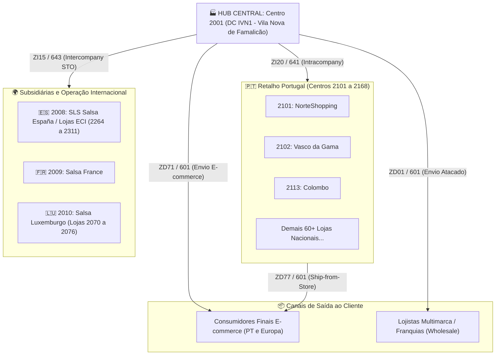

# Base de Conhecimento: Arquitetura Logística, Faturação SD e Split Contábil FI (SAP S/4HANA)

**Empresa / Sistema**: Salsa Jeans (IVN) | SAP PRD (`S4P`) Mandante 100  
**Escopo**: Módulos SD, LE, MM-IM, MM-PUR e FI  
**Data de Consolidação**: Setembro / 2026  
**Status**: Documento de Referência Técnica e Operacional  

---

## 1. Objetivo deste Documento

Este documento consolida o conhecimento técnico e operacional sobre a **cadeia de suprimentos e logística**, o processo de **faturação SD** e a **integração contábil em FI**, esclarecendo:
1. Como as mercadorias circulam entre os centros logísticos, subsidiárias e lojas da Salsa Jeans.
2. Os motivos pelos quais certos pedidos e faturas acumulam milhares de linhas e desdobram-se em múltiplas remessas.
3. A mecânica de disparo e resolução do erro **`F5 727: Número máximo de posições em FI atingido (999)`**.
4. O funcionamento da BAdI **`FI_BILL_ISSUE_SPLIT`** e da classe **`ZCLFI_BILL_ISSUE_SPLIT`**.
5. O mapeamento completo do universo real de documentos com `BLART = ZV` e as diretrizes de governança para regras de sumarização (`TTYPVX`).

---

## 2. Topologia da Rede Logística (Centros e Locais de Expedição)

A operação logística da Salsa Jeans estrutura-se no modelo **Hub-and-Spoke**:



### Centros Principais (`T001W`):
* **`2001` (DC IVN1 - Centro de Distribuição Central)**: Local de onde parte a esmagadora maioria das expedições mundiais.
* **`2008` (SLS Salsa España)** / **`2009` (Salsa France)** / **`2010` (Salsa Luxemburgo)**: Centros das empresas internacionais do grupo.
* **`2101` a `2168`**: Lojas físicas de Portugal (shoppings e rua).
* **`2264` a `2311`**: Corners no *El Corte Inglés* (ECI) e lojas próprias em Espanha.

---

## 3. Matriz dos 5 Grandes Fluxos Logísticos End-to-End

O cruzamento entre pedidos, remessas físicas, movimentos de estoque e faturamento estrutura-se da seguinte forma:

| Processo de Negócio | Pedido de Origem | Tipo de Remessa (`LFART`) | Tipo Mov. (`BWART`) | Faturação SD (`FKART`) | Doc. FI Principal | Doc. FI Detalhe (Split) |
| :--- | :---: | :---: | :---: | :---: | :---: | :---: |
| **E-commerce B2C (Online)** | `ZO01` / `ZO09` | **`ZD71`** / `ZD77` | `601` (Saída venda) | `ZI05` | `RV` | `ZV` |
| **E-commerce B2C (Devoluções)** | `ZO11` / `ZO18` | **`ZD81`** / `ZD87` | `651` / `653` (Devolução) | `ZCN5` | `RA` | `ZV` |
| **B2B Atacado / Grossista** | `ZS01` / `ZS45` | **`ZD01`** | `601` (Saída venda) | `ZI03` | `RV` | `ZV` |
| **B2B Devoluções Comerciais** | `ZR01` | **`ZR01`** | `651` / `653` | `ZCN3` / `ZCN1` | `RA` | `ZV` |
| **Transferência Intercompany (STO)** | `ZI15` / `ZI06` | **`ZI15`** | **`643`** (Trânsito IC) | **`ZIG2`** | **`RH`** | **`ZV`** |
| **Devolução Intercompany (Loja $\rightarrow$ CD)** | `ZI25` / `ZI47` | **`ZI25`** | `644` / `651` | `ZIG2` / `ZCN5` | `RH` / `RA` | `ZV` |
| **Transferência Intracompany (Lojas PT)** | `ZI03` / `ZI20` | **`ZI20`** / `ZI03` | **`641`** (Trânsito intra) | *(Sem fatura)* | *(Sem FI)* | *(Sem FI)* |
| **Consignação (El Corte Inglés)** | `ZC01` (Fill-up) | **`ZD01`** / `ZI15` | `631` (Consig. envio) | *(Sem fatura)* | *(Sem FI)* | *(Sem FI)* |
| **Venda em Consignação (ECI)** | `ZC02` (Issue) | `ZD01` | `633` (Baixa consig.) | `ZI05` / `ZI03` | `RV` | `ZV` |

---

## 4. Por que Pedidos e Faturas Acumulam Milhares de Linhas?

### A. Fatores de Expansão de Linhas no Pedido
1. **Matriz de Grade de Moda (Tamanho / Cor)**:
   * Cada artigo de vestuário desdobra-se em múltiplos códigos de material (`MATNR`) para contemplar cada tamanho (ex.: 28 a 44, XS a XXL). Uma ordem com 100 modelos pode facilmente ultrapassar 1.000 SKUs físicos distintos.
2. **Transferências em Lote (Intercompany STO)**:
   * Os abastecimentos das filiais de Espanha ou armazéns de consignação (`ZI15`) são consolidados em paletes inteiras cobrindo coleções completas.

### B. Critérios de Split de Remessa (`LIKP`)
O SAP força a quebra em remessas distintas sempre que houver divergência nos campos mandatórios de cabeçalho:
* **Local de Expedição (`VSTEL`)**: Cada remessa só pode ter uma única origem física.
* **Data da Remessa (`LFDAT`)**: Linhas confirmadas para datas diferentes geram entregas separadas.
* **Recebedor da Mercadoria (`KUNNR`)**: Destinatários físicos diferentes.
* **Disponibilidade ATP / Entregas Parciais (`AUTLF`)**: Se parte do estoque não estiver disponível de imediato, o sistema expede o saldo disponível e deixa o restante para remessas posteriores.

---

## 5. O Limite de 999 Linhas em FI e o Disparo do Erro `F5 727`

### A Causa Técnica
No módulo contábil (`FI`), o campo de numeração de linha da tabela `BSEG` (**`BUZEI`**) é definido no dicionário de dados como **`NUMC 3`** (3 dígitos numéricos: `001` a `999`).

### O Ponto de Disparo no Código Standard
No include **`LFACIFPP`** (rotina `PROJECT_TO_V_TABLES`, linhas 1057 a 1066):
```abap
COUNT = COUNT + 1.
...
XVBSEG-BUZEI = COUNT.
IF XVBSEG-BUZEI = 0.
  MESSAGE E727 WITH 999.   " <--- Disparo do erro F5 727
ENDIF.
```
Ao atingir a posição 1.000, o contador estoura o campo de 3 dígitos, volta para `000` e dispara o erro impeditivo de contabilização.

---

## 6. Mecanismo de Particionamento (Split Contábil) e BAdI `FI_BILL_ISSUE_SPLIT`

Para evitar o erro `F5 727`, a função standard `FI_DOCUMENT_PROJECT` (include `LFACIU04`) invoca a rotina de split contábil **antes** de gravar as linhas:

```abap
PERFORM SPLIT_INVOICE.        " Localizado em LFACIFSI
PERFORM PROJECT_TO_V_TABLES.  " Numera as linhas FI (estoura se não dividiu)
```

### A BAdI `FI_BILL_ISSUE_SPLIT`
A ativação do particionamento de faturas de SD é controlada pela BAdI standard `FI_BILL_ISSUE_SPLIT`, cuja implementação customizada ativa no sistema é a classe **`ZCLFI_BILL_ISSUE_SPLIT`**:

1. **`ACTIVATE_AUTOMATIC_SPLIT`**:
   * Define `E_AUTOMATIC_SPLIT = 'X'`.
2. **`SET_NUMBER_OF_INVOICE_ITEMS`** *(Ponto Crítico Identificado)*:
   ```abap
   METHOD IF_EX_FI_BILL_ISSUE_SPLIT~SET_NUMBER_OF_INVOICE_ITEMS.
   *    e_number_of_invoice_items = 900.
   ENDMETHOD.
   ```
   > [!WARNING]
   > A linha `e_number_of_invoice_items = 900` está **comentada** no SAP PRD. O sistema depende exclusivamente da avaliação dinâmica de volume em `DET_SPLIT_DOC_STRUCTURE`. Se essa rotina abortar prematuramente, o documento não quebra e estoura no erro `F5 727`.
3. **`SET_DOCUMENT_TYPE_SUBSEQ`**:
   * Define `E_DOCUMENT_TYPE_SUBSEQ = 'ZV'`, indicando que os documentos contábeis secundários gerados pela quebra assumem o tipo de documento **`ZV`** (enquanto o cabeçalho original é `RH` ou `RV`).
4. **Conta de Compensação de Split (`SPL`)**:
   * O equilíbrio financeiro entre os documentos particionados é garantido pela conta transitória configurada na tabela `T030` (operação `SPL`, conta `0027800800`).

---

## 7. O Universo Real de Documentos ZV no SAP PRD (Empresa 2010)

Investigação 100% read-only realizada sobre todos os documentos `BKPF` com `AWTYP = VBRK`, `BLART = ZV` e `BUKRS = 2010` (exercícios 2025 e 2026):

* **Total de Documentos FI ZV**: 1.562 documentos
* **Total de Faturas SD Distintas**: 591 faturas
* **Total de Posições BSEG**: 1.266.618 posições

### Distribuição por Tipo de Faturamento SD (`FKART`):

| FKART | Descrição do Processo | BLART TVFK | Docs FI ZV | Posições BSEG | % Posições |
| :--- | :--- | :---: | ---: | ---: | ---: |
| **`ZI05`** | Faturação Loja / Retalho | `RV` | 702 | 648.192 | **51,18%** |
| **`ZI03`** | Faturação Grossista / Atacado | `RV` | 415 | 264.038 | **20,85%** |
| **`ZCN5`** | Nota de Crédito Retalho | `RA` | 184 | 158.822 | **12,54%** |
| **`ZI01`** | Faturação Geral | `RV` | 175 | 127.287 | **10,05%** |
| **`ZS1`** | Faturação de Serviços | *(vazio)* | 27 | 22.725 | **1,79%** |
| **`ZIG2`** | **Faturação Intercompany** | **`RH`** | **26** | **18.661** | **1,47%** |
| **Outros** | `ZCN3`, `ZCN1`, `ZDN1`, `ZI02` | `RA`/`RV` | 33 | 26.893 | **2,12%** |

> [!IMPORTANT]
> **Fato Comprovado**: O fluxo intercompany `ZIG2` **não é o único e nem o principal gerador de documentos ZV** (representa apenas **1,47%** das posições). O tipo `ZV` é compartilhado por 10 processos, onde **98,53%** do volume decorre de vendas a clientes e notas de crédito comerciais.

---

## 8. Avaliação de Risco e Diretrizes para Sumarização (`TTYPVX`)

### Simulação no Caso de Estudo `2541036794` (ZIG2)
* **Situação Atual**: 1.946 posições gerando 2 documentos ZV (`7900000619` com 991 linhas e `7900000620` com 955 linhas).
* **Simulação com `TTYPVX` suprimindo `MATNR` ou `MATNR + SGTXT`**:
  * Posições resultantes: **2 posições contábeis** (redução de 99,9%).
  * Diferença Financeira: **0,00 EUR** (integridade monetária perfeita).
  * Centros de lucro (`PRCTR`), segmentos e parceiros de consolidação (`VBUND`) mantidos 100% íntegros.
  * **O split 991+955 seria completamente evitado**.

### Por que NÃO aplicar TTYPVX diretamente em ZV?
* **Classificação de Risco: ALTO**.
* Como `BLART = ZV` é compartilhado pelos fluxos de loja (`ZI05`) e grossista (`ZI03`), uma regra genérica para ZV suprimiria o código do material nas partidas individuais de mais de 1,2 milhão de linhas de vendas comerciais.
* Isso afetaria relatórios de auditoria financeira, apuração de margem contábil clássica e integrações que consultam `BSEG-MATNR`.

### Solução de Arquitetura Recomendada:
1. **Não alterar a tabela `TTYPVX` para o tipo `ZV`**.
2. **Criar um tipo de documento contábil exclusivo** para o fluxo intercompany `ZIG2` (ex.: **`Z2`**).
3. Ajustar o método `SET_DOCUMENT_TYPE_SUBSEQ` da BAdI `FI_BILL_ISSUE_SPLIT` para atribuir `Z2` apenas quando `FKART = 'ZIG2'`.
4. Configurar a regra `TTYPVX` (`MATNR + SGTXT`) **exclusivamente para o novo tipo `Z2`**:
   ```text
   VBRK | Z2 | 2010 | BSEG | MATNR
   VBRK | Z2 | 2010 | BSEG | SGTXT
   ```
   * **Resultado**: Resolve 100% o problema do limite de 999 linhas no intercompany com **risco zero** para o retalho e atacado.

---

## 9. Inventário de Códigos e Ferramentas Disponíveis no Projeto

Todos os fontes ABAP extraídos do SAP e ferramentas de teste foram versionados e integrados ao repositório local e ao GitHub:

* **Diretório Central**: [`Analise_Programas/FI_BILL_ISSUE_SPLIT_999_LINHAS/`](file:///C:/workspace/SapScript/Analise_Programas/FI_BILL_ISSUE_SPLIT_999_LINHAS/)
  * [`abap/ZCLFI_BILL_ISSUE_SPLIT.abap`](file:///C:/workspace/SapScript/Analise_Programas/FI_BILL_ISSUE_SPLIT_999_LINHAS/abap/ZCLFI_BILL_ISSUE_SPLIT.abap): Código ABAP da classe implementadora.
  * [`abap/LFACIFSI.abap`](file:///C:/workspace/SapScript/Analise_Programas/FI_BILL_ISSUE_SPLIT_999_LINHAS/abap/LFACIFSI.abap): Código standard completo da rotina `SPLIT_INVOICE`.
  * [`abap/LV60BF00.abap`](file:///C:/workspace/SapScript/Analise_Programas/FI_BILL_ISSUE_SPLIT_999_LINHAS/abap/LV60BF00.abap): Rotina de interface SD $\rightarrow$ FI.
  * [`scripts/diagnostico_split_badi.py`](file:///C:/workspace/SapScript/Analise_Programas/FI_BILL_ISSUE_SPLIT_999_LINHAS/scripts/diagnostico_split_badi.py): Script RFC para auditoria da classe e conta `SPL`.
  * [`scripts/diagnostico_itens_fatura.py`](file:///C:/workspace/SapScript/Analise_Programas/FI_BILL_ISSUE_SPLIT_999_LINHAS/scripts/diagnostico_itens_fatura.py): Validador de faturas de alta volumetria.
* **Diretório de Outputs e Dados**: [`output/`](file:///C:/workspace/SapScript/output)
  * [`vbrk_zv_2010_analysis.json`](file:///C:/workspace/SapScript/output/vbrk_zv_2010_analysis.json): Base JSON com métricas de 1.562 documentos.
  * [`vbrk_zv_2010_fkart_matrix.csv`](file:///C:/workspace/SapScript/output/vbrk_zv_2010_fkart_matrix.csv): Tabela comparativa dos 10 tipos de fatura.
  * [`vbrk_zv_2010_simulation.csv`](file:///C:/workspace/SapScript/output/vbrk_zv_2010_simulation.csv): Simulações de redução e validações financeiras.
